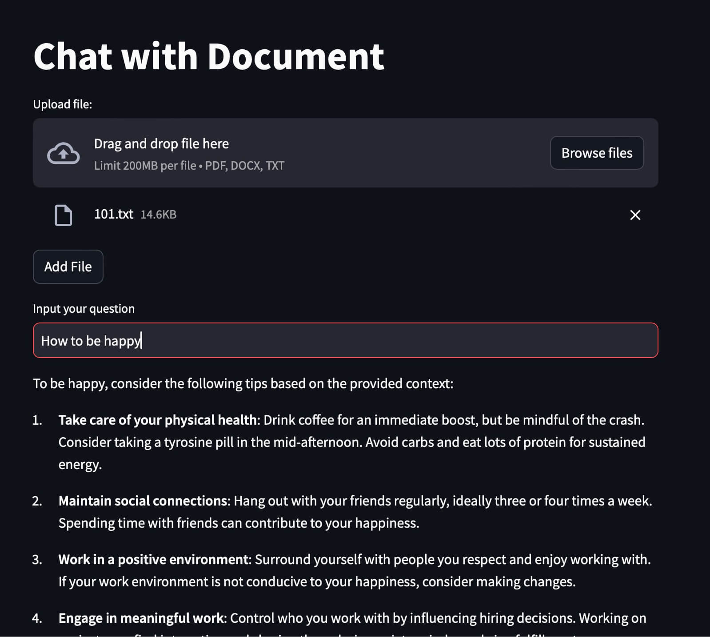

# InkChatGPT

A Simple LLM app that demonstrates a Retrieval-Augmented Generation (RAG) model for question-answering using LangChain, ChromaDB, and OpenAI's language models.

The app allows users to upload documents (PDFs or text files), and then ask questions related to the content of those documents.

The RAG model retrieves relevant passages from the documents and generates an answer based on the retrieved context.

---



---

## Table of Contents

-   [Installation](#installation)
-   [Usage](#usage)
-   [Contributing](#contributing)
-   [License](#license)

# Usage

Clone the repository:

```bash
git clone https://github.com/vinhnx/InkChatGPT.git
```

1. **Open VSCode and Create a New Python Environment**:

-   Open Visual Studio Code.
-   Open the Command Palette by pressing `Ctrl+Shift+P` (Windows/Linux) or `Cmd+Shift+P` (macOS).
-   Search for "Python: Create Environment" and select it.
-   Choose the option to create a new virtual environment.
-   Give the environment a name (e.g., "llm-rag-env") and select the Python interpreter version you want to use.

2. **Select the Python Interpreter**:

-   Once the virtual environment is created, you'll be prompted to select the Python interpreter.
-   From the Command Palette, search for "Python: Select Interpreter" and choose the interpreter you just created (e.g., "llm-rag-env").

3. **Open the Project Folder**:

-   From the File menu, choose "Open Folder" or "Open..." and navigate to the project folder containing the `app.py` file.

4. **Install Required Packages**:

-   Open a new Terminal in VSCode by clicking "Terminal" > "New Terminal" or pressing `Ctrl+Shift+`" (Windows/Linux) or `Cmd+Shift+`" (macOS).
-   In the terminal, run the following command to install the required packages:
    ```
    pip install streamlit langchain chromadb openai tiktoken pypdf
    ```

5. **Configure the App**:

-   Open the `app.py` file in the VSCode editor.
-   Set your OpenAI API key by modifying the `OPENAI_API_KEY` variable.
-   Optionally, you can change the `CHROMA_PERSIST_DIRECTORY` and `OPENAI_MODEL` variables according to your preferences.

6. **Run the Streamlit App**:

-   In the terminal, navigate to the project directory if you're not already there.
-   Run the following command to start the Streamlit app:
    ```
    streamlit run app.py
    ```
-   This will start the Streamlit app and provide you with a local URL to access the app in your web browser.

7. **Use the App**:

-   Open the provided local URL in your web browser.
-   You should see the InkChatGPT interface.
-   Follow the instructions in the app to upload documents and ask questions.

## Contributing

Contributions are welcome! If you'd like to improve the Medium Article Generator, please follow these steps:

1. Fork the repository
1. Create a new branch `git checkout -b feature/my-feature`
1. Commit your changes `git commit -am 'Add some feature'`
1. Push to the branch `git push origin feature/my-feature`
1. Create a new Pull Request

## License

This project is licensed under the MIT License.

## Contact

I'm Vinh, [@vinhnx](https://x.com/vinhnx) on almost everywhere.
